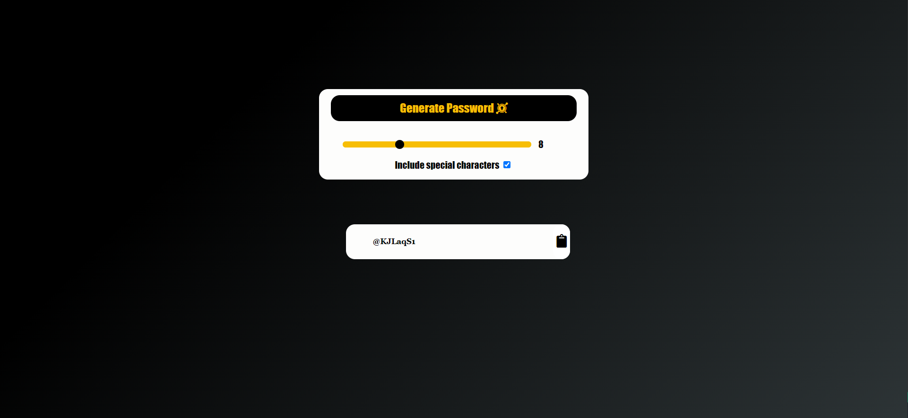

# Password-Generator

**It is a password generation website to generate random passwords by following the rules**

**Skills shown :** `HTML` `CSS` `Javascript` 

**Rules followed :-**
- At least 1 uppercase character (A-Z) 
- At least 1 lowercase character (a-z) 
- At least 1 digit (0-9) at least 1 special character (donot forget to treat space as special character too)
- At least 10 characters 
- At most 25 characters not more than 2 identical characters in a row (e.g., aaa not allowed)

### Screenshot :-

